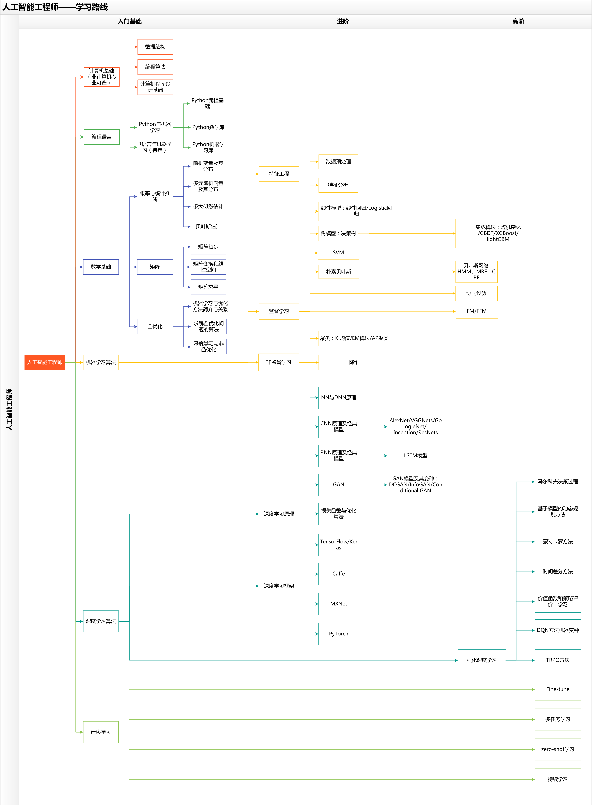

knowledge-structure-diagram

# 整理的各系列知识结构图:

├──[accessibility知识结构图.png](./accessibility知识结构图.png)
├──[agile知识结构图.png](./agile知识结构图.png)
├──[aimind.png](./aimind.png)
├──[android知识结构图.png](./android知识结构图.png)
├──[angularjs知识结构图.png](./angularjs知识结构图.png)
├──[architecture知识结构图.png](./architecture知识结构图.png)
├──[blockchain知识结构图.png](./blockchain知识结构图.png)
├──[bluemix知识结构图.png](./bluemix知识结构图.png)
├──[cocos知识结构图.png](./cocos知识结构图.png)
├──[computernetworks知识结构图.png](./computernetworks知识结构图.png)
├──[cplusplus知识结构图.png](./cplusplus知识结构图.png)
├──[csharp知识结构图.png](./csharp知识结构图.png)
├──[c知识结构图.png](./c知识结构图.png)
├──[datastructure知识结构图.png](./datastructure知识结构图.png)
├──[deeplearning知识结构图.png](./deeplearning知识结构图.png)
├──[docker知识结构图.png](./docker知识结构图.png)
├──[dotnet知识结构图.png](./dotnet知识结构图.png)
├──[embeddeddevelopment知识结构图.png](./embeddeddevelopment知识结构图.png)
├──[git知识结构图.png](./git知识结构图.png)
├──[go知识结构图.png](./go知识结构图.png)
├──[Go知识图谱.png](./Go知识图谱.png)
├──[hadoop知识结构图.png](./hadoop知识结构图.png)
├──[hive知识结构图.png](./hive知识结构图.png)
├──[html5知识结构图.png](./html5知识结构图.png)
├──[ios知识结构图.png](./ios知识结构图.png)
├──[javaee知识结构图.png](./javaee知识结构图.png)
├──[javascript知识结构图.png](./javascript知识结构图.png)
├──[javase知识结构图.png](./javase知识结构图.png)
├──[java知识结构图.png](./java知识结构图.png)
├──[jquery知识结构图.png](./jquery知识结构图.png)
├─[js in one pic.png](./js in one pic.png)
├──[linux知识结构图.png](./linux知识结构图.png)
├──[liveplay知识结构图.png](./liveplay知识结构图.png)
├──[machinelearning知识结构图.png](./machinelearning知识结构图.png)
├──[Mysql.png](./Mysql.png)
├──[mysql知识结构图.png](./mysql知识结构图.png)
├──[nodejs知识结构图.png](./nodejs知识结构图.png)
├──[objective-c知识结构图.png](./objective-c知识结构图.png)
├──[opencv知识结构图.png](./opencv知识结构图.png)
├──[operatingsystem知识结构图.png](./operatingsystem知识结构图.png)
├──[oracle知识结构图.png](./oracle知识结构图.png)
├──[php知识结构图.png](./php知识结构图.png)
├──[py3 in one pic.png](./py3 in one pic.png)
├──[Python课程体系.png](./Python课程体系.png)
├──[python知识结构图.png](./python知识结构图.png)
├──[reactnative知识结构图.png](./reactnative知识结构图.png)
├──[react知识结构图.png](./react知识结构图.png)
├──[redis知识结构图.png](./redis知识结构图.png))
├──[rust知识结构图.png](./rust知识结构图.png)
├──[scala知识结构图.png](./scala知识结构图.png)
├──[softwaretest知识结构图.png](./softwaretest知识结构图.png)
├──[spark知识结构图.png](./spark知识结构图.png)
├──[swift知识结构图.png](./swift知识结构图.png)
├──[unity3d知识结构图.png](./unity3d知识结构图.png)
├──[vr知识结构图.png](./vr知识结构图.png)
├──[Vue.js知识结构图.png](./Vue.js知识结构图.png)
├──[Vue.js知识结构图２.png](./Vue.js知识结构图２.png)
└──[wechat知识结构图.png](./wechat知识结构图.png)
